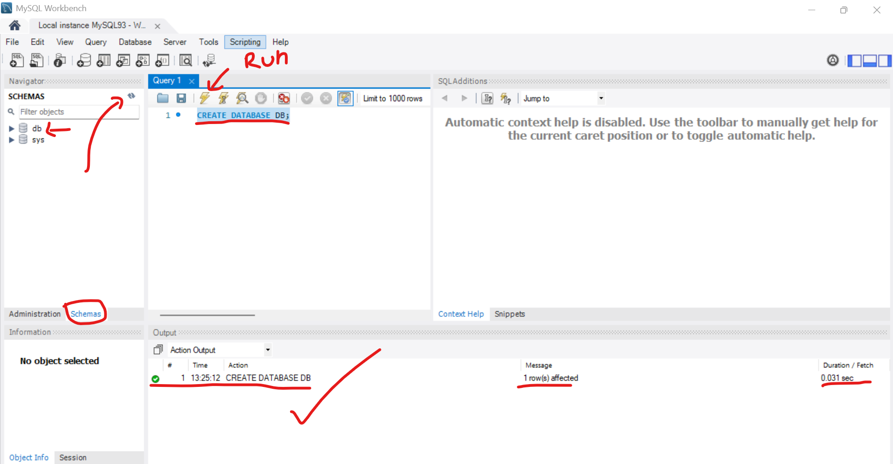
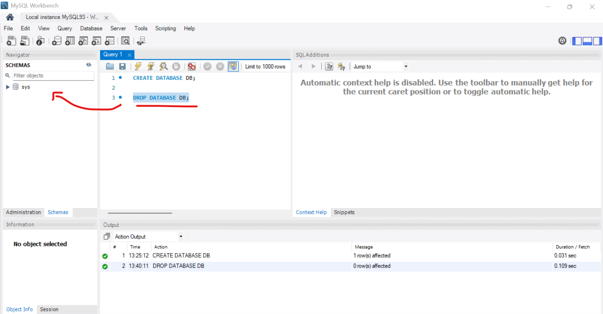
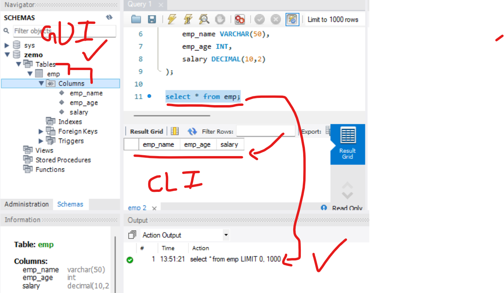
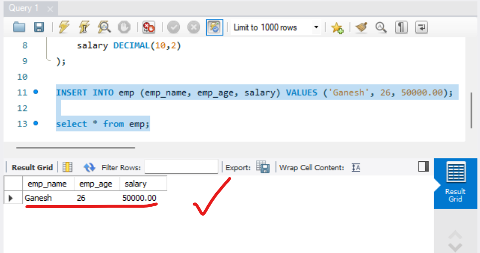
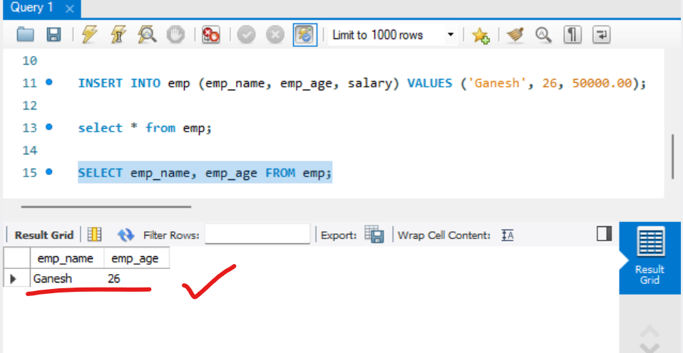
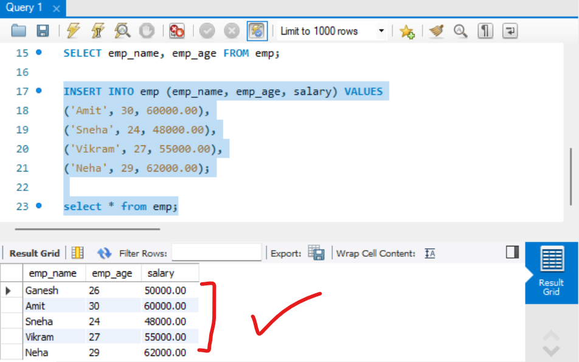

## Create database  
```sql
CREATE DATABASE DB;
```  
##### Preview:  
  

## Drop database (`Remove Database permenantly`)  
```sql
DROP DATABASE DB;
```  
##### Preview:  
  

## Create a table  
we will create new database named ZEMO & inside that will create a table    
```sql
CREATE TABLE emp (
    emp_name VARCHAR(50),
    emp_age INT,
    salary DECIMAL(10,2)
);
```  
In `DECIMAL(10,2)`:
* **10** = total number of digits allowed (precision)
* **2** = number of digits after the decimal point (scale)

So, max value can be:
`99999999.99` (8 digits before decimal + 2 digits after)

## See our table  
```sql
select * from emp;
```  
##### Preview:  
  

## Insert a single record  
```sql
INSERT INTO emp (emp_name, emp_age, salary) VALUES ('Ganesh', 26, 50000.00);
```  
##### Preview:  
  

## See only selective columns  
```sql
SELECT emp_name, emp_age FROM emp;
```  
##### Preview:  
  

## Insert multiple values  
```sql
INSERT INTO emp (emp_name, emp_age, salary) VALUES
('Amit', 30, 60000.00),
('Sneha', 24, 48000.00),
('Vikram', 27, 55000.00),
('Neha', 29, 62000.00);
```  
##### Preview:  
  