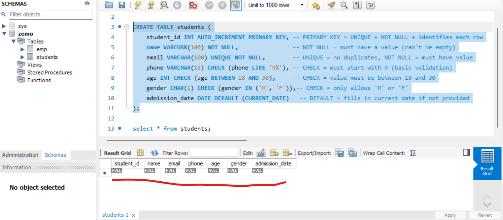
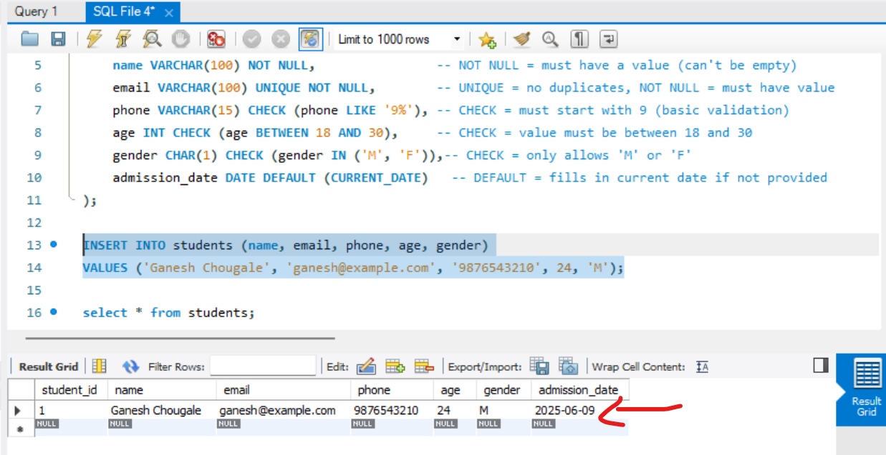

## Create table with constraints  
```sql
CREATE TABLE students (
    student_id INT AUTO_INCREMENT PRIMARY KEY, -- PRIMARY KEY = UNIQUE + NOT NULL + identifies each row
    name VARCHAR(100) NOT NULL,                -- NOT NULL = must have a value (can't be empty)
    email VARCHAR(100) UNIQUE NOT NULL,        -- UNIQUE = no duplicates, NOT NULL = must have value
    phone VARCHAR(15) CHECK (phone LIKE '9%'), -- CHECK = must start with 9 (basic validation)
    age INT CHECK (age BETWEEN 18 AND 30),     -- CHECK = value must be between 18 and 30
    gender CHAR(1) CHECK (gender IN ('M', 'F')),-- CHECK = only allows 'M' or 'F'
    admission_date DATE DEFAULT (CURRENT_DATE)   -- DEFAULT = fills in current date if not provided
);
```  
##### Preview:  
  

## value insertion  
```sql
INSERT INTO students (name, email, phone, age, gender)
VALUES ('Ganesh Chougale', 'ganesh@example.com', '9876543210', 24, 'M');
```  
##### Preview:  
  