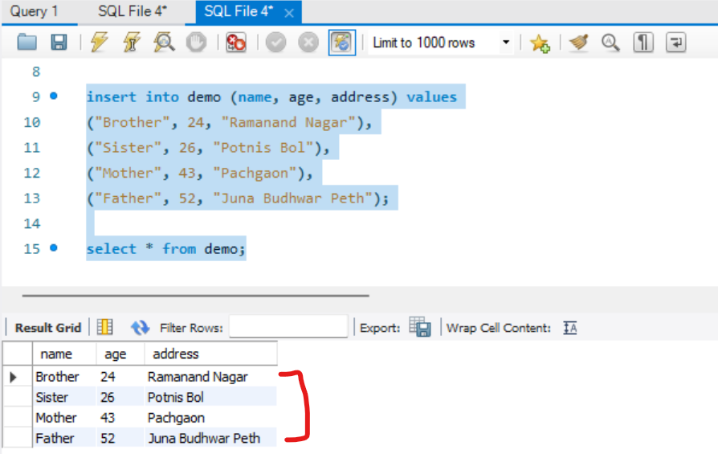
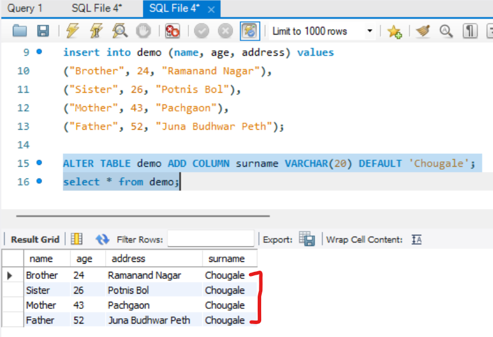
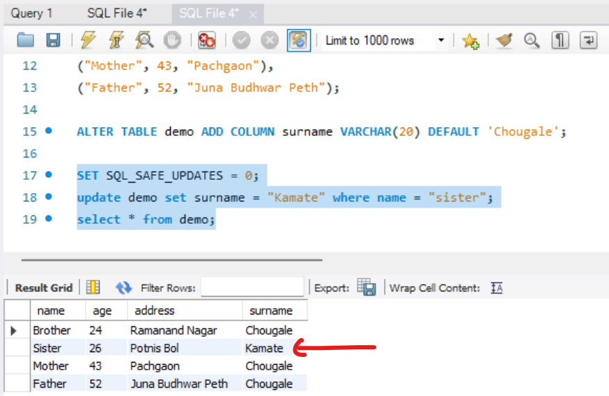

Update: change in values  
Alter: change in table  

lets see with an example:  
create table  
```sql
use zemo;

create table demo(
name varchar(50),
age int,
address varchar(50)
);

select * from demo;
```  
insert values inside it  
```sql
insert into demo (name, age, address) values
("Brother", 24, "Ramanand Nagar"),
("Sister", 26, "Potnis Bol"),
("Mother", 43, "Pachgaon"),
("Father", 52, "Juna Budhwar Peth");

select * from demo;
```  
##### Preview:  
  

## Alter: (Modify table)  
```sql
ALTER TABLE demo ADD COLUMN surname VARCHAR(20) DEFAULT 'Chougale';
```  
##### Preview:  
  

## Update: (Modify value)  
```sql
update demo set surname = "Kamate" where name = "sister";
```  
##### Preview:  
   

## Disable & re Unable the MySql Safe Update Mode  
```sql
SET SQL_SAFE_UPDATES = 0;   -- disable safe update
SET SQL_SAFE_UPDATES = 1;   -- Re-Unable safe update
```  