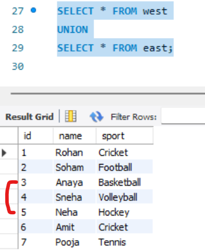
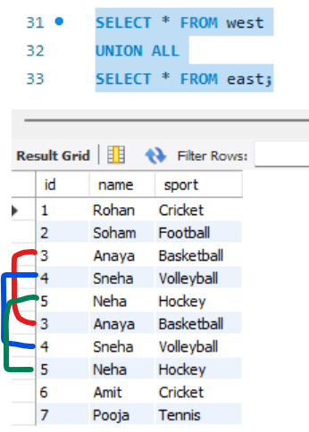
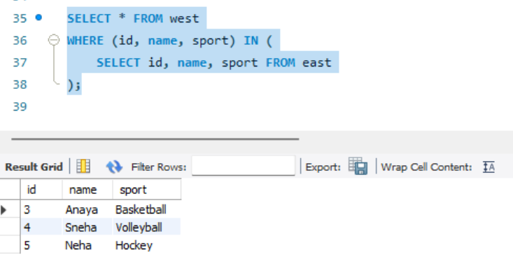
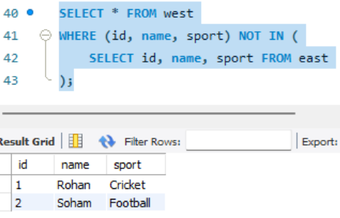

to under stande set operators lets create 2 tables first.  
```sql
create table west(
id int,
name varchar(50),
sport varchar(50)
);
```  
```sql
create table east(
id int,
name varchar(50),
sport varchar(50)
);
```  
lets add values in both table  
```sql
INSERT INTO west (id, name, sport) VALUES
(1, 'Rohan', 'Cricket'),
(2, 'Soham', 'Football'),
(3, 'Anaya', 'Basketball'),
(4, 'Sneha', 'Volleyball'),
(5, 'Neha', 'Hockey');
```  
```sql
INSERT INTO east (id, name, sport) VALUES
(3, 'Anaya', 'Basketball'),
(4, 'Sneha', 'Volleyball'),
(5, 'Neha', 'Hockey'),
(6, 'Amit', 'Cricket'),
(7, 'Pooja', 'Tennis');
```  
# Sets  
- `UNION` (no duplicates)

- `UNION ALL` (with duplicates)

- `INTERSECT` (common rows)

- `EXCEPT` (rows in west but not east, or vice versa)  

## 1. `UNION` – Combines rows from both tables, do not repeat duplicates:  
```sql
SELECT * FROM west
UNION
SELECT * FROM east;
```  
##### Preview:  
  
as we can see union donot repeat duplicate values  

## 2. `UNION ALL` – Combines all rows (including duplicates):  
```sql
SELECT * FROM west
UNION ALL
SELECT * FROM east;
```  
##### Preview:  
  

## 3. `INTERSECT` - Only the common rows  
```sql
SELECT * FROM west
INTERSECT
SELECT * FROM east;
-- but MySql donot support INTERSECT but we can simulate it  
```  
like this:  
```sql
SELECT * FROM west
WHERE (id, name, sport) IN (
    SELECT id, name, sport FROM east
);
```  
##### Preview:  
  

## 4. `EXCEPT` (aka MINUS): means values from 1st table but not from 2nd table  
```sql
SELECT * FROM west
EXCEPT
SELECT * FROM east;
-- but MySql donot support EXCEPT but we can simulate it  
```  
like this:  
```sql
SELECT * FROM west
WHERE (id, name, sport) NOT IN (
    SELECT id, name, sport FROM east
);
```  
##### Preview:  
  