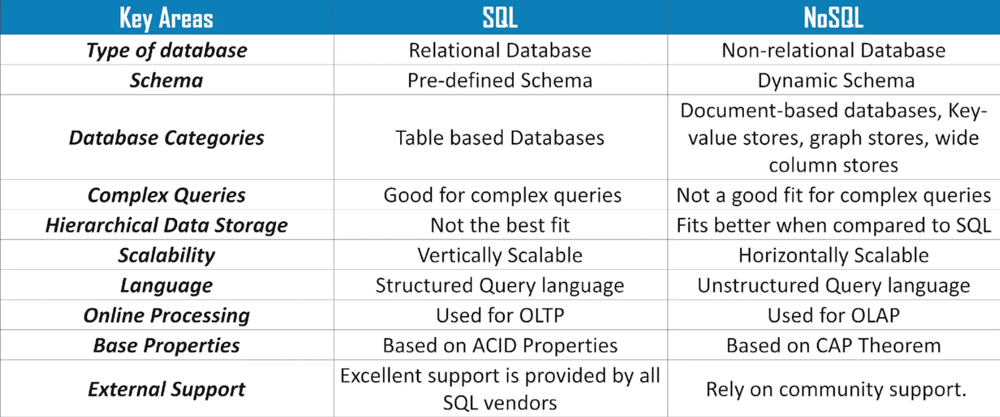
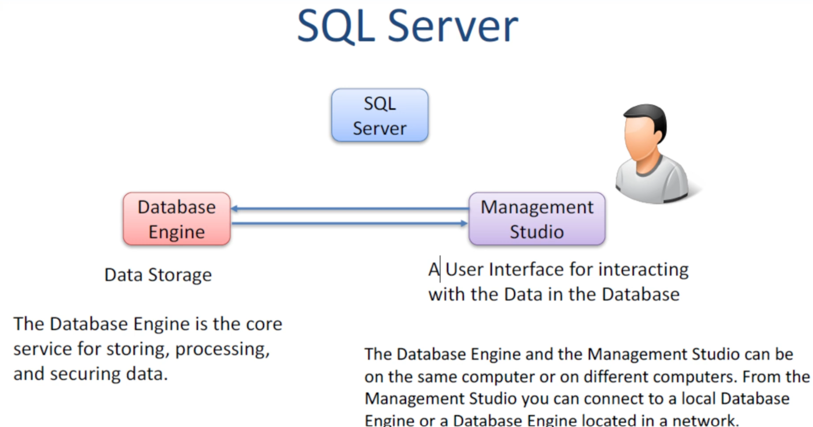

what is RDBMS?

Properties:-

1. Insert/Update/Delete information based on conditions.
2. Accept SQL Queries.
3. Security.
4. Transactional Control
5. Manage data sharing/access rules  

##### Preview:  
  

##### Preview:  
  