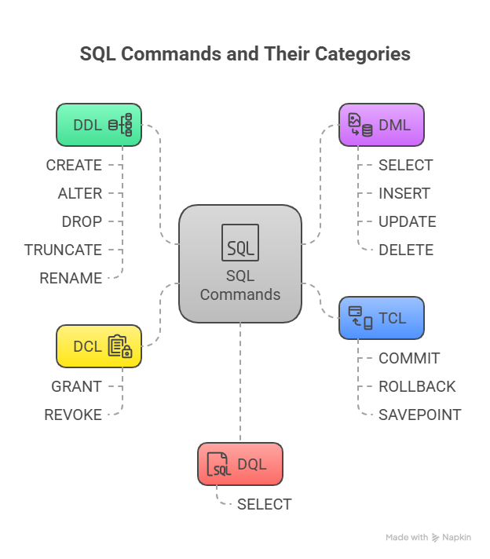

```sql
SQL Commands
├── DDL (Data Definition Language)
│   ├── CREATE
│   ├── ALTER
│   ├── DROP
│   ├── TRUNCATE
│   └── RENAME
│
├── DML (Data Manipulation Language)
│   ├── SELECT
│   ├── INSERT
│   ├── UPDATE
│   └── DELETE
│
├── DCL (Data Control Language)
│   ├── GRANT
│   └── REVOKE
│
├── TCL (Transaction Control Language)
│   ├── COMMIT
│   ├── ROLLBACK
│   └── SAVEPOINT
│
└── DQL (Data Query Language)
    └── SELECT
```  

##### Preview:  
  