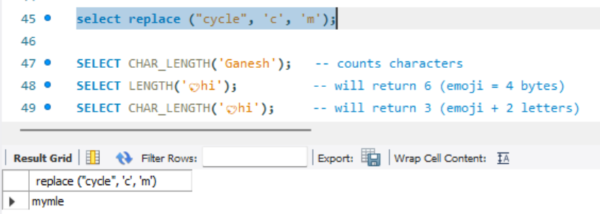
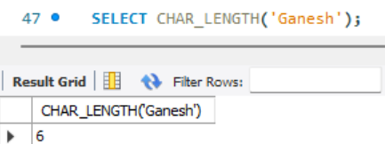

## ✅ **String Manipulation Functions in MySQL**

| Function                     | Purpose                       | Example                      | Output     |
| ---------------------------- | ----------------------------- | ---------------------------- | ---------- |
| `LENGTH(str)`                | Byte length of string         | `LENGTH('Ganesh')`           | `6`        |
| `CHAR_LENGTH(str)`           | Number of characters          | `CHAR_LENGTH('💖hi')`        | `3`        |
| `CONCAT(a,b)`                | Join multiple strings         | `CONCAT('Gan', 'esh')`       | `'Ganesh'` |
| `CONCAT_WS(sep, a, b)`       | Join with separator           | `CONCAT_WS('-', 'G', 'S')`   | `'G-S'`    |
| `UPPER(str)`                 | Convert to uppercase          | `UPPER('ganesh')`            | `'GANESH'` |
| `LOWER(str)`                 | Convert to lowercase          | `LOWER('GANESH')`            | `'ganesh'` |
| `SUBSTRING(str, start, len)` | Extract substring             | `SUBSTRING('Ganesh', 2, 3)`  | `'ane'`    |
| `LEFT(str, len)`             | Left N characters             | `LEFT('Ganesh', 3)`          | `'Gan'`    |
| `RIGHT(str, len)`            | Right N characters            | `RIGHT('Ganesh', 2)`         | `'sh'`     |
| `REPLACE(str, from, to)`     | Replace substring             | `REPLACE('cycle', 'c', 'm')` | `'mymle'`  |
| `INSTR(str, substr)`         | Position of substring         | `INSTR('Ganesh', 'ne')`      | `3`        |
| `LOCATE(substr, str)`        | Same as INSTR                 | `LOCATE('s', 'Ganesh')`      | `5`        |
| `POSITION(substr IN str)`    | Like LOCATE                   | `POSITION('sh' IN 'Ganesh')` | `5`        |
| `REVERSE(str)`               | Reverse string                | `REVERSE('Ganesh')`          | `'hsenag'` |
| `TRIM(str)`                  | Remove leading/trailing space | `TRIM(' Ganesh ')`           | `'Ganesh'` |
| `LTRIM(str)`                 | Remove leading space          | `LTRIM(' Ganesh')`           | `'Ganesh'` |
| `RTRIM(str)`                 | Remove trailing space         | `RTRIM('Ganesh ')`           | `'Ganesh'` |
| `LPAD(str, len, pad)`        | Left pad to length            | `LPAD('5', 3, '0')`          | `'005'`    |
| `RPAD(str, len, pad)`        | Right pad to length           | `RPAD('5', 3, '0')`          | `'500'`    |
| `ASCII(char)`                | ASCII value of char           | `ASCII('A')`                 | `65`       |
| `CHAR(code)`                 | Char from ASCII code          | `CHAR(65)`                   | `'A'`      |
| `FIELD(val, list...)`        | Position in list              | `FIELD('B', 'A', 'B', 'C')`  | `2`        |
| `ELT(pos, str1, str2...)`    | Value at index                | `ELT(2, 'A', 'B', 'C')`      | `'B'`      |

---

```sql
select replace ("cycle", 'c', 'm');
```  
##### Preview:  
  

```sql
SELECT CHAR_LENGTH('Ganesh');
```  
##### Preview:  
    